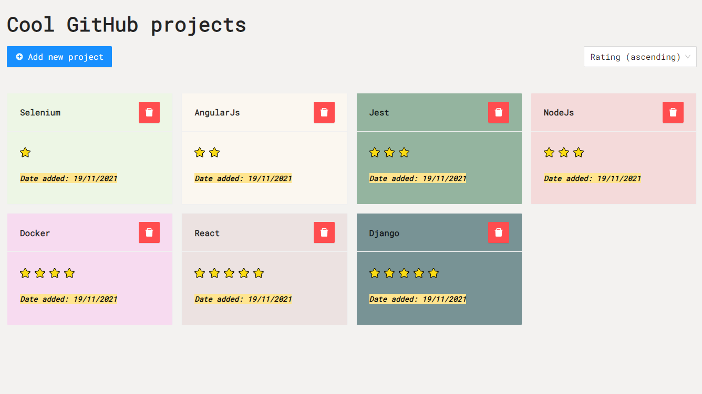

# Cool GitHub projects

This project was made for a mysterious company as a part of their recruiting process. It was bootstrapped with [Create React App](https://github.com/facebook/create-react-app) and uses [TypeScript](https://www.typescriptlang.org/). In the app you can view, add & remove GitHub projects, which are persisted in the browsers Local Storage. You can also sort projects by rating or date. The project comes with unit tests that are made with [React Testing Library](https://testing-library.com/docs/react-testing-library/intro/) and enforced linting via [Prettier](https://prettier.io/).

## Prerequisites

To run the project all you need is [Node.js](https://nodejs.org/) and [NPM](https://www.npmjs.com/).\
Developed and tested with Node.js version 16.5.0 and NPM version 7.19.1

## Setup & use

Clone the repository and install required depedencies by running `npm install` in the project directory. After that you can run:

### `npm start`

Runs the app in the development mode.\
Open [http://localhost:3000](http://localhost:3000) to view it in the browser.

The page will reload if you make edits.\
You will also see any lint errors in the console.

### `npm test`

Launches the test runner in the interactive watch mode.\
See the section about [running tests](https://facebook.github.io/create-react-app/docs/running-tests) for more information.

### `npm run build`

Builds the app for production to the `build` folder.\
It correctly bundles React in production mode and optimizes the build for the best performance.

The build is minified and the filenames include the hashes.

### `npm run format`

Manually runs linting with Prettier.\
It is recommended to have Prettier extension installed on your editor (eg. Visual Studio Code) and setup so that it runs on every file save.

### Created by [Robert Laitila](https://github.com/goebers)
